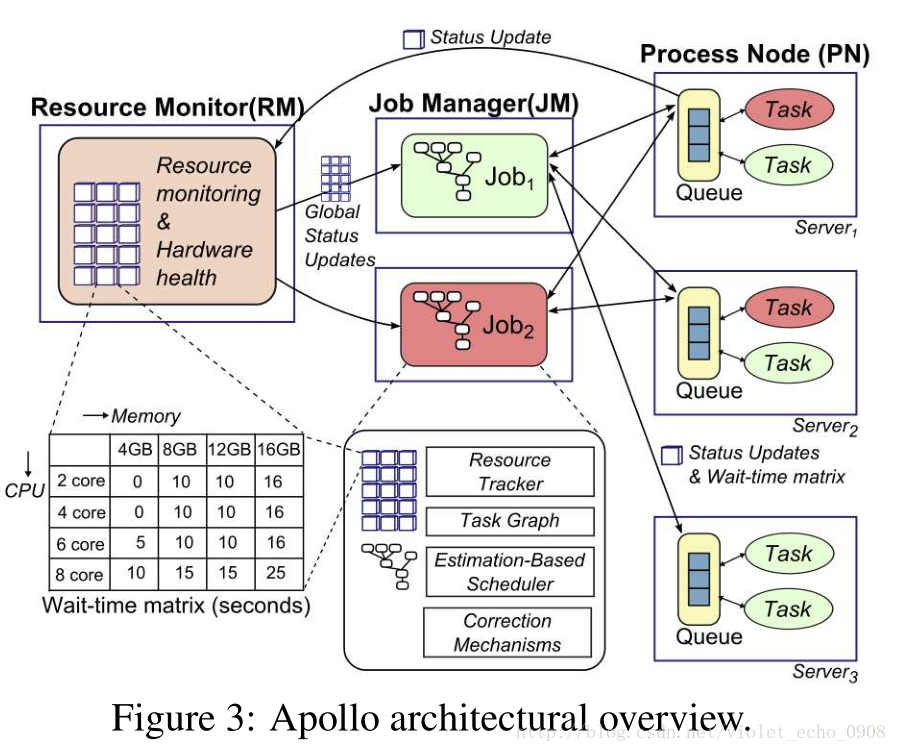
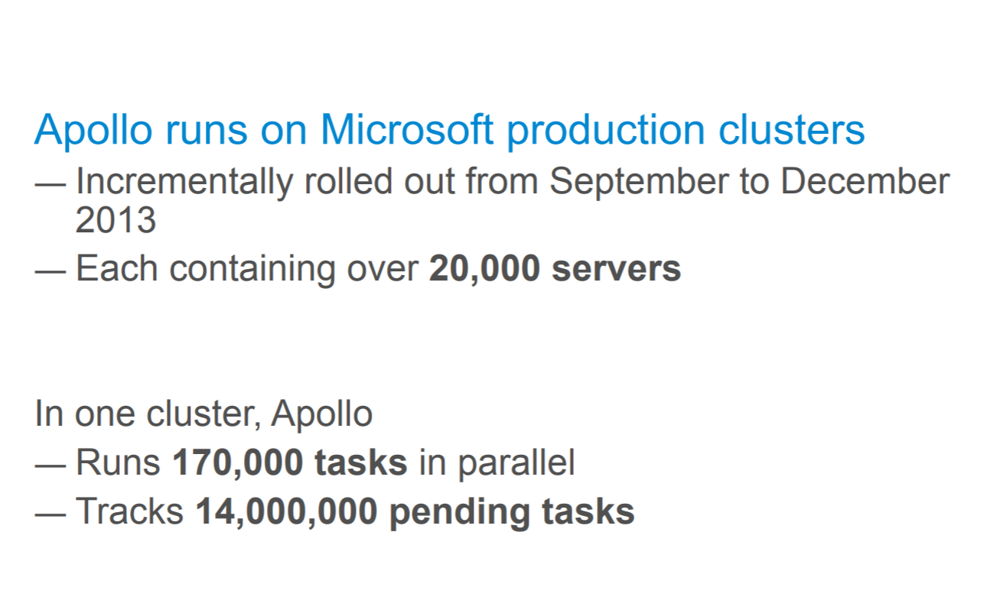
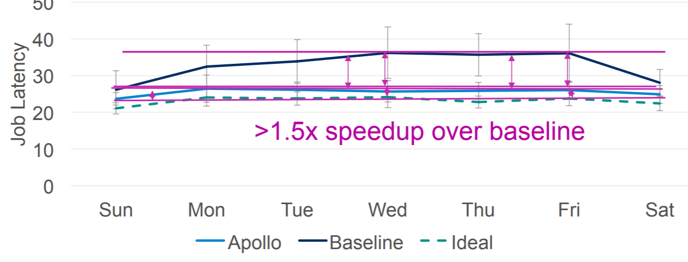
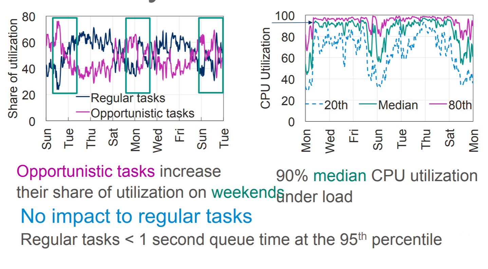

Apollo Microsoft
================

> ***Scalable and Coordinated*** 
> ***Scheduling for Cloud-Scale Computing***

---
Introduction
==========
Apollo是已经部署在微软实际生产环境中的集群调度系统，每天负责上万台机器上数以百万计的高并发计算任务的调度和管理。

---
Key Features
============
Apollo使用基于 **共享状态** 的策略。
**调度器(Job Manager)** 
* 负责Job的生命周期管理,拥有全局资源视图，
* 具有整个集群的完全访问权限。

**处理节点(Process Node)** 
* 负责管理所在server上的本地资源和调度。

**资源监控器(Resource Monitor)** 
* 负责维护一个全局共享的集群状态，即持续收集集群所有Process Node的负载信息
* 向每个Job Manager提供集群状态的全局视图。
---

Characteristics
===============
1. Apollo采用 **分布式** 和 **松散协调** 的调度框架。
>传统的中心式调度框架，其可扩展性有很大的限制，为了平衡可扩展性和调度质量，该工作采用了分布式的调度框架，每个调度器根据整个集群的信息独立地进行调度
2. Apollo将每个任务的 **完成时间最小化**。
>Apollo通过估计模型来对每一个提交的作业的任务完成时间进行预估，模型中同时考虑数据的局部性、服务器负载和其他各种因素，并根据这些因素进行加权决策，估计模型还可以通过以往类似作业的运行信息来对时间估计进行进一步的细化。
---
Characteristics
===============
3. 调度器拥有 **整个集群** 的信息，供其进行 **调度决策**。
>Apollo引入了轻量级的硬件独立机制来为调度器提供集群中所有服务器上的资源使用情况，拱调度器使用。
4. Apollo提供了一系列的 **校正机制**。
>集群中可能会出现作业运行时间估计不准确、作业冲突、运行时一些不正常的行为等意外状况，Apollo提供的校正机制可以在集群运行时动态的对其进行调整。
5. Apollo引入了 **机会调度（opportunistic scheduling）**。
>Apollo将作业分成了两类：***常规作业（ regular tasks）*** 和 ***机会作业（ opportunistic tasks）*** ，保证常规作业的低延迟的同时使用机会作业提高集群的利用率，并引入了基于token的机制管理容量并通过限制常规任务的总数来避免集群的负载过高。
---

Pros & Cons
===========
---

Pros
====
1. ***Scale Well***
2. ***Perform Well***
3. ***Use resources Efficiently***
---

How well does Apollo scale？
===========================

---

How well does Apollo Perform？
===========================

---

How well does Apollo use resources efficiently？
===========================

---

Cons
====
### *SEVERAL* Days of Delay
>Apollo使用了一个低优先级的后台随机执行策略
>来增加资源利用率
>因此会产生几天的延迟。
---

My Own Comment
==============
Apollo与众不同的是它已经部署在了微软的生产环境上了，每天要对数十亿的作业进行合理的调度，性能肯定已经得到了保证。并且Apollo在和Borg差不多量级的集群下可以获取更高流量的输出，减少了延迟并且增加了集群的利用率。
而且去中心化、分布式更像是以后云计算的发展方向
同时增加资源的利用率也能让微软有立足之本。

