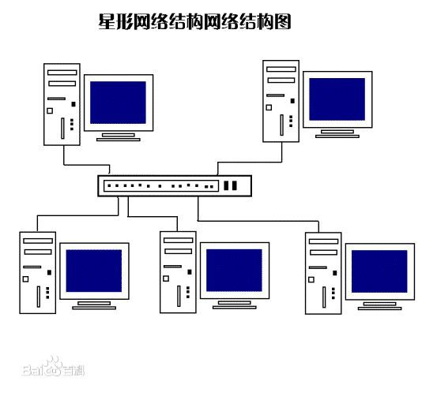
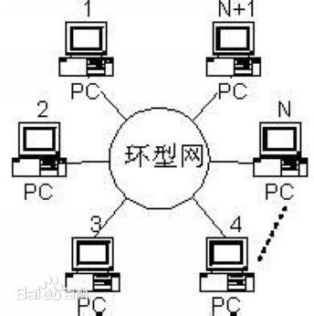
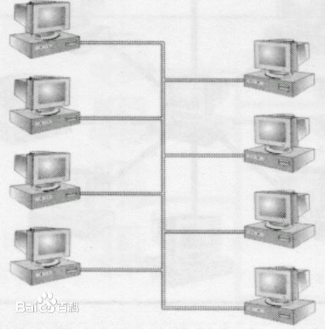

# Network

---
>## *Part1*
# Introduction

---
# Introduction
>在信息技术中，计算机网络（也称为数据网络）是通过通信路径互连的一系列点或节点，用于发送，接收和交换数据，语音和视频流量。
>
-> 物理上而言，网络是一个按照地理远近组成的层次系统
-> 对主机而言，网络是一种I/O设备，是数据源和数据的接受方

---
>## *Part2*
# Types

---
# Types
>地理位置
>
1. 局域网（LAN）：一般限定在较小的区域内，小于10km的范围，通常采用有线连接
2. 城域网（MAN）：规模局限在一座城市的范围内，10～100km的区域
3. 广域网（WAN）：网络跨越国界、洲界，甚至全球范围

---
# Types
>传输介质
>
Name | 传输介质 | Pros | Cons
-|-|-|-
有线网|同轴电缆和双绞线|经济实惠、安装便利|易受干扰，传输率较低、传输距离较短
光纤网|光导纤维|传输距离长、传输率高、抗干扰性强|价格较高
无线网|电磁波|联网方式灵活方便|价格较高

---
# Types
>拓扑结构
>
1. 星型网络：各站点通过点到点的链路与中心站相连。
***Pros***: 容易在网络中增加新的站点，数据的安全性和优先级容易控制，易实现网络监控
***Cons***: 中心节点的故障会引起整个网络瘫痪

---
# Types
>拓扑结构
>
2. 环形网络：各站点通过通信介质连成一个封闭的环形
***Pros***: 容易安装和监控
***Cons***: 容量有限，网络建成后，难以增加新的站点

---
# Types
>拓扑结构
>
3. 总线型网络：网络中所有的站点共享一条数据通道
***Pros***: 安装简单方便，需要铺设的电缆最短，成本低，某个站点的故障一般不会影响整个网络
***Cons***: 介质的故障会导致网络瘫痪，安全性低，监控比较困难，增加新站点也不如星型网容易

---
>## *Part3*
# Key Indicators

---
# Key Indicators
### 通信设备
+ 集线器
  >将多条以太网双绞线或光纤集合连接在同一段物理介质下的设备
  >

---
# Key Indicators
### 通信设备
+ 网桥
  >连接两个局域网的一种存储/转发设备
  >

---
# Key Indicators
### 通信设备
+ 路由器
  >连接因特网中各局域网、广域网的设备
  >

---
# Key Indicators
### 网络协议
+ 命名机制
  >定义一种一致的主机地址格式，消除不同技术中主机地址的差异
  >
+ 传送机制
  >定义一种把数据位捆扎成不连续的片（包）的统一方式
  >*eg. TCP/IP协议*
  >

---
>## *Part4*
# My Comments

---
# My Comments
1. 互联网发展迅速，但网络安全问题依然亟待解决。个人信息泄密、数据资料盗用等现象依然严峻，应尽快落实网络立法的同时，加强安全网络基础设施建设和端系统的安全
2. 应用系统中的网络发展是必然趋势，这方面的研究有待提升。
3. 计算机网络的开放性需要进一步提高。

---
# THANKS

