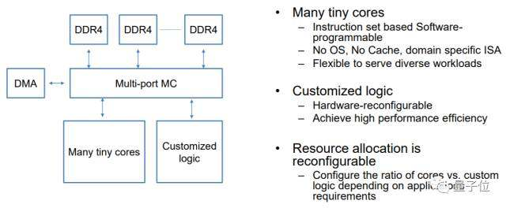
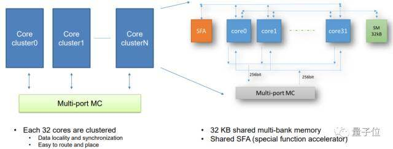

Technical Report abt xPU
========================
# Baidu
 
# Xilinx
___

Features
========
* **256cores、基于FPGA的云计算加速**
* **性能和效率之间实现平衡**
* **并处理多样化的计算任务**
___

Pros
====
* **芯片架构突出多样性**
* **着重于计算密集型**
* **着重于基于规则的任务**
* **确保效率、性能和灵活性的最大化**

 
___

Cons
====
* **可编程能力**
  >尚未提供编译器
* **需要额外配备硬件**
  >需要一个配备高带宽低延时内存
  >高带宽I/O接口的大型数学阵列

___

Key Indicators
==============
* **主频**
  >处理器的时钟频率，或者说是工作频率
* **外频**
  >外频是处理器的基准频率，决定着整块主板的运行速度
* **前端总线(FSB)频率**
  >总线频率是直接影响处理器与内存直接数据交换速度
  >数据带宽=(总线频率×数据位宽)/8
* **处理器的位和字长**
  >处理器在单位时间内能一次处理的二进制数的位数叫字长
* **协处理器**
  >协处理器主要的功能就是负责浮点运算
___

Key Indicators
==============
* **倍频系数**
  >倍频系数是指处理器主频与外频之间的相对比例关系
  >在相同的外频下，倍频越高处理器的频率也越高

* **流水技术**
  >在处理器中由5~6个不同功能的电路单元组成一条指令处理流水线
  >将一条X86指令分成5~6步后再由这些电路单元分别执行
  >一个CPU时钟周期完成一条指令，提高了CPU的运算速度

* **超线程**
  >可以同时执行多重线程，就能够处理器发挥更大效率
  >超线程技术减少了系统资源的浪费，
  >可以把单核模拟成双核使用，更有效地提高性能。
___

My Own Comment
==============
1. **硬件决定系统的能力，软件决定硬件上限；**
2. **FPGA不是万能的，特别是针对计算密集型且多样化的任务**
3. **异构多核是趋势。**
4. **Trade-Off：**
   * 可以为xPU提供编译器，这样就可以在一定程度上弥补FPGA可编程能力的不足，同时还可以利用FPGA专注特定计算任务较为高效的特点