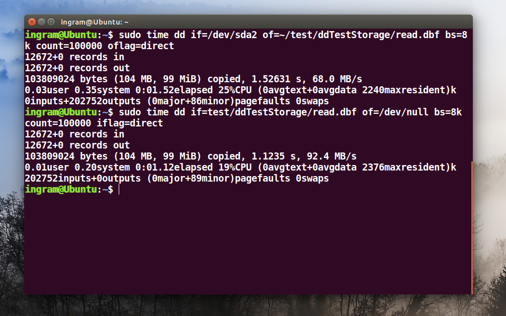
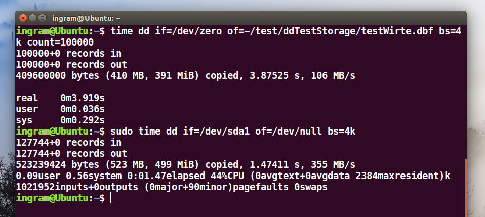
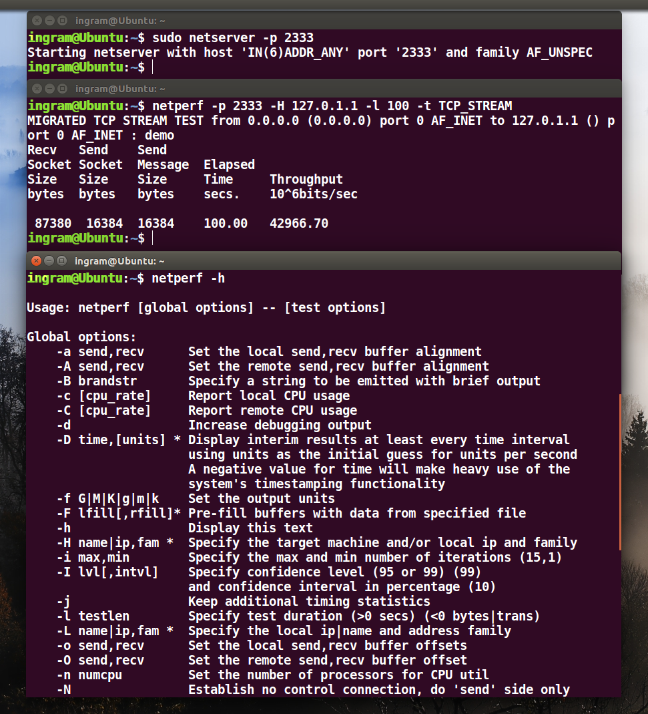

TaskA
=====

### ***Measure***  
### ***STORAGE & NETWORK***
___

Basic Steps of the report:
==========================
>* ***测试环境***
>
>* ***测试工具***
>
>* ***性能测试案例执行***
>
>* ***测试结果分析***
___

Test Environment：
===========
> ## Operating System : 
> 
> * ### ***Ubuntu 16.04 LTS*** 
> 
> ## CPU:
> 
> * ### ***Intel(R) Core(TM) i7-6700HQ***
> 
> ## Memory:
> 
> * ### ***8G RAM***
___

Test Tools：
===========
## Linux中 ***time*** 命令
## 用来计算:
> * ### 某个程序的运行耗时(real)
> * ### 用户态cpu耗时(user)， 
> * ### 系统态cpu耗时(sys)。
___

Test Tools：
===========
## Linux中 ***dd*** 命令
## 用来创建一个虚拟的块设备 
> * ### if=XXX ***代表输入文件。默认从stdin中读取输入***
> * ### of=XXX ***代表输出文件。默认从stdout作为输出***
> * ### bs=XXX ***代表字节为单位的块大小***
> * ### countXXX ***代表被复制的块数***
> * ### /dev/zero ***一个字符设备，会不断返回字节‘\0’***
___

Test Result：
============
## Directly IO to Disk

___

Test Result：
============
## Directly IO to Memory

___

Test Tools：
===========
## Linux中 ***netperf*** 命令测试网络性能
***详情如下***
___

Test Result：
============
## Directly IO to Disk

___

Test Analyzing：
===============
## Memory is approximately 10 timesfaster than Disk 