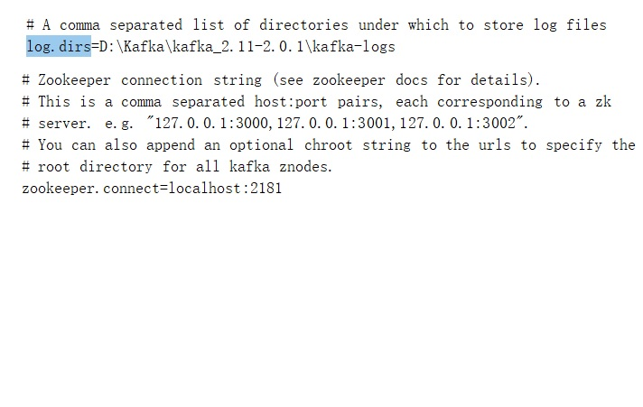
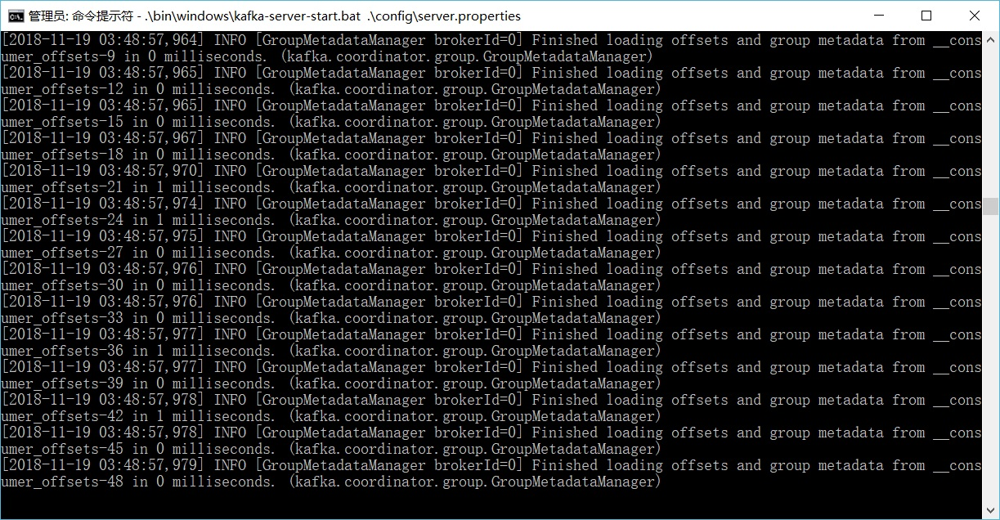

# A setup for Kafka cluster
# First Step - Zookeeper Installation
The first thing to do is to install zookeeper, and I get the sources I needed from the   
following website:  
http://zookeeper.apache.org/releases.html#download  
I chose the version 3.4.13.  
## Step 1
Unzip the zookeeper-3.4.13.tar.gz file and config the 'zoo.cfg' as following:  

## Step 2 
Add env varieties as following:  

## Step 3
After solving some problems(see the 'Some problems & solutions' part)  
type "zkServer", and we have started the zookeeper service:  

# Second Step - Kafka Cluster Installation
Secondly, we'll have to install Kafka. Also, I get the file source from the following website:  
http://kafka.apache.org/downloads  
Here I chose the version kafka_2.11-2.0.1.
## Step 1
Unzip the kafka_2.11-2.0.1.tgz and config the 'server.properties as following:  
  
## Step 2
Type the following command:  
.\bin\windows\kafka-server-start.bat .\config\server.properties
And we have started the Kafka service.  

# Third Step - Kafka test 
Enter the Kafka directory and type the following command:  
.\bin\windows\kafka-topics.bat --create --zookeeper localhost:2181  
 --replication-factor 1 --partitions 1 --topic test  
In another cmd, type the following command:  
.\bin\windows\kafka-topics.bat --list --zookeeper localhost:2181  
And we type some words in the producer window as following:  

And we got the message we want in the consumer:

# Some problems & solutions
When starting zkServer, we need to config the env varieties:  
JAVA_HOME