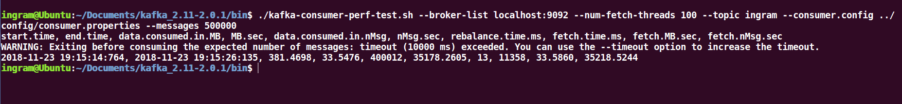
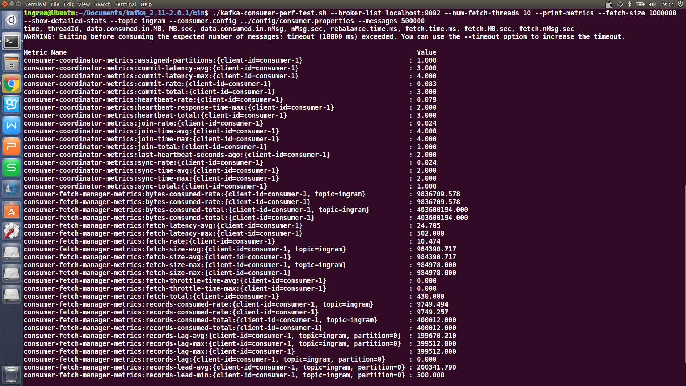

Test the stats of Kafka
=======================
* ## Using the embedded tool 
* # Kafka-xxx-perf-test.sh
***PERF***
==========
___

Basic Steps of the report:
==========================
>* ***测试环境***
>
>* ***测试工具***
>
>* ***性能测试案例执行***
>
>* ***测试结果分析***
___

Test Environment：
===========
> ## Operating System : 
> 
> * ### ***Ubuntu 16.04 LTS*** 
> 
> ## CPU:
> 
> * ### ***Intel(R) Core(TM) i7-6700HQ***
> 
> ## Memory:
> 
> * ### ***8G RAM***
___

Testing Consumer:
=================
> ## broker-list: 
> * ### refer to the server IP
> ## num-fetch-threads: 
> * ### refer to the number of concurrent thread
> ## topic: 
> * ### refer to the topic of the message
> ## consumer.config: 
> * ### refer to the config FILE
___

Testing Result of Consumer:
=================

___

Testing Result of Consumer:
=================

___

Testing Producer:
=================
> ## num-record: 
> * ### refer to the number of the message to fetch
> ## topic: 
> * ### refer topic of the message
> ## producer.config: 
> * ### refer to the config FILE
> ## throughput: 
> * ### refer to the thoughput number
___

Testing Result of Producer:
=================

___

Testing Result of Producer:
=================

___

Testing Result of Producer:
=================

___

Test Analyzing
==============
> * ## Kafka speeds up the io rate