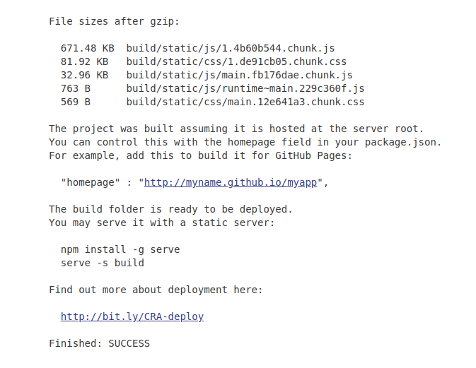
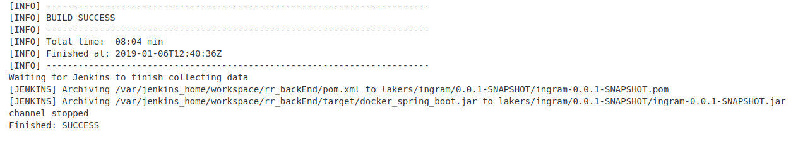
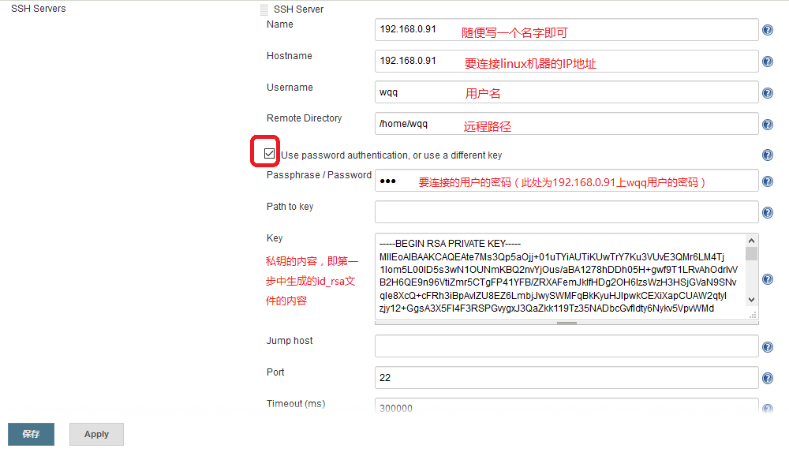

># Part1

## Step 1: Prepare a CI/CD environment
1. 从镜像仓库中下载jenkins镜像
```
$ docker pull jenkins/jenkins:lts
```
2. 运行docker容器
``` 
$ docker run --name jenkins7 -p 8087:8080 -p 50007:50000 --privileged=true -v /usr/local/bin/docker:/usr/bin/docker -v /var/run/docker.sock:/var/run/docker.sock -d jenkins/jenkins:lts
```
3. 将8080端口映射至8087，并在localhost:8087中配置jenkins
4. CI/CD Frontend
a. 在global tool configuration安装Nodejs
b. 创建一个“自由风格的软件项目”的job


5. CI/CD Backend
a. 在global tool configuration安装Maven Integration Plugin
b. 在docker容器中下载maven，并将路径添加至global tool configuration
c. 创建一个“Maven项目”的job


## Step2: Prepare a web application build container images

1. Frontend
   + 下载nginx镜像
  ```
  $ docker pull nginx
  ```
   + 配置docker-compose，创建并编辑docker-compose.yml
   + 创建并编辑 nginx.conf 以支持react-router
   + 创建并启动容器
   ```
   $ docker-compose up -d
   ```

2. Database
   + 下载mysql镜像
   + 启动镜像
  ```
  $ docker run -name mysqleatornot -e MYSQL_ROOT_PASSWORD=LiLingHui981001 -p 3306:3306 -d mysql:5.7
  ```
   + 进入容器
  ```
  $ docker exec -it mysqleatornot /bin/bash
  ```
   + 登陆mysql，配置远程登录授权
   + 将数据库的.sql脚本导入容器

3. Backend
   + 创建并编辑Dockerfile
   + 将Dockerfile和打包好的docker_spring_boot.jar放入同一文件夹，cd到该文件夹中创建镜像
```$ docker build -t springboot/eatornot .
```
   + 启动容器并连接mysql的容器
```
$ docker run -d -p 8080:8080 --link mysqleatornot:db springboot/eatornot
```

## Step3: Automatically build images after a PR

1. 在docker中声称SSH密钥，并在jenkins中配置SSH
 
2. 运行一个private docker registry
```
$ docker run -itd -p 5000:5000 -v <some_host_path>:/var/lib/registry --name registry registry:2.5
```

3. Frontend
添加Post-build Actions
```
$ cd <full remote directory path>
$ /usr/local/bin/docker-compose down
$ /usr/local/bin/docker-compose up -d
```

4. Backend
添加Post-build Actions
```
$ cd <full remote directory path>
$ sh docker.sh $BUILD_NUMBER $GIT_COMMIT
```