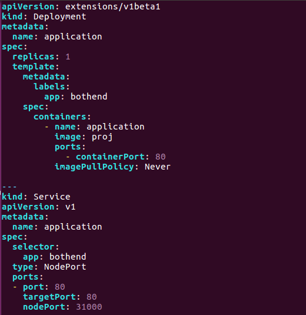

# Deployment of a java web application onto Kubernetes
## Preperation 
### Deployed Kubernetes and docker environment  
We have done this in Task1.
### Prepared web application 
We have done this in Task2. 
### A ready mirror image for our web application  
After all the above, type:
```
docker build -t /rrproj/EatOrNot
```
And we've got our web application packed into a mirror image and ready to deploy on K8s.
Note: In this part, we packed both frontend and backend into a mirror image for simplicity.  
## Deployment
The key step for this task is to config the deployment.yaml.
Since we use local mirror image to deploy, we have to modify the deployment.yaml as following:  

### Some notification:
1. We have to set the port and targetPort to 80, so that other machines can visit with default port. Also, we have to set nodePort to 31000 to config the port of Kubernetes pods.  
2. Since we use local image, we have to set imagePullPolicy to never to avoid errors such as failure to pull images.  
3. We have to set our image to proj which is build on docker on our machine.  
### Deploy and test
Type:  
```
kubectl create -f deployment.yaml
```
And we can see our deployment by typing:  
```
kubectl get deployment
```
And we can see the running condition of our application by typing:  
```
kubectl get pod
```
and
```
kubectl get svc
```
Also, we can see the running condition of our program by typing:
```
docker ps
```
(Detailed information can be seen from the video in this folder)

## Visit our web application
By visiting localhost:31000 in web browser, we can visit our own web application which is deployed on Kubernetes.
## For more details, see the video in this folder.
