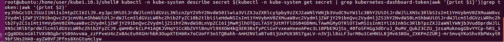
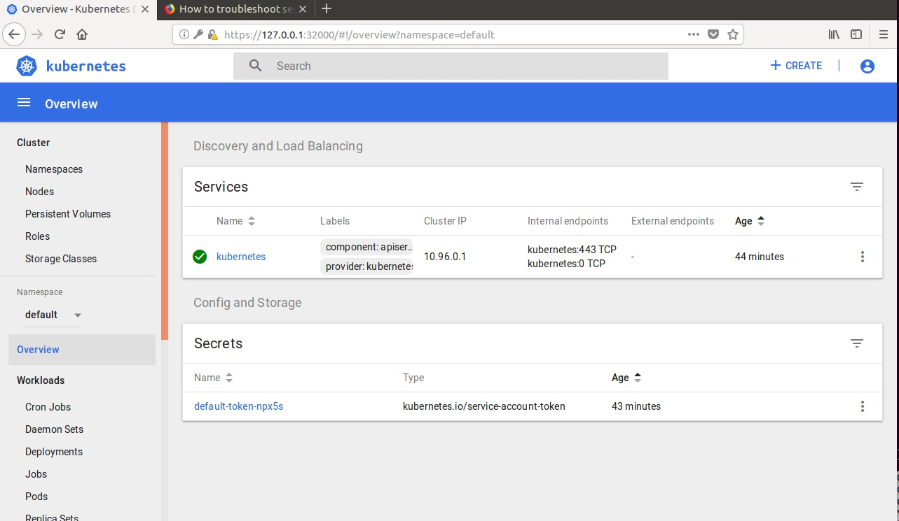
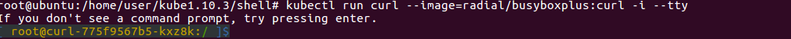
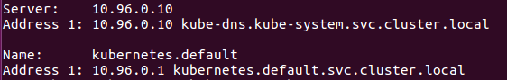
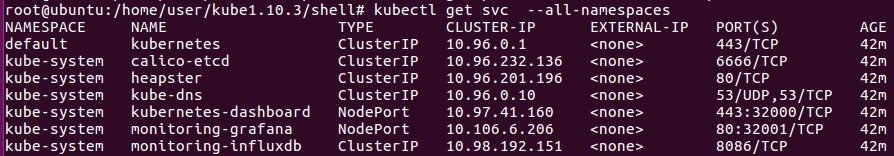
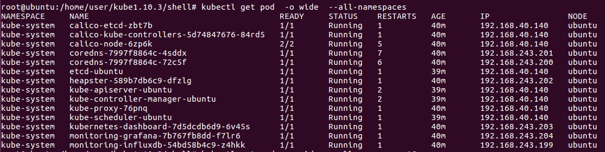

# Building up Kubernetes(Single Host)
> ## Operating System : 
> 
> * ### ***Ubuntu 16.04 LTS*** 
## Preparation
We need to disable selinux and firewall before building up kubernetes. Swap also needs to be disabled.  
```
systemctl stop firewalld && systemctl disable firewalld
swapoff -a
setenforce 0
```
Also, we need to write configuration file for kubernetes.
```
cat <<EOF >  /etc/sysctl.d/k8s.conf
net.bridge.bridge-nf-call-ip6tables = 1
net.bridge.bridge-nf-call-iptables = 1
EOF
```
Next, we need to install docker.  
For me, I installed docker with apt-get:
```
sudo apt-get install docker
sudo apt-get install docker.io
```
Finally, since the mirrors are from google, we need to deal with the GFW.  
Relevant jobs are omitted.
## Kubernetes Installation
### Preparation
First, we need to get the cgroup-driver of docker, which shoul be the same as the environment variety of kubeadm. Typing:
```
docker info | grep -i cgroup
``` 
The out put is 
```
Cgroup Driver: cgroupfs
```
So we nend to modify the 10-kubeadm.conf.
Since the download speed is too slow, I take every measures to get images from domestic.  
Finally, I've found one packed in 'images.tar'.
### Load images into docker
By typing:
```
docker load -i ../images/images.tar
```
The outputs are omitted here.
### Configuration for kubeadm
We just need to write configuration into kubeadm.conf, just as following:
```
cat <<EOF > /etc/systemd/system/kubelet.service.d/10-kubeadm.conf
[Service]
Environment="KUBELET_KUBECONFIG_ARGS=--bootstrap-kubeconfig=/etc/kubernetes/bootstrap-kubelet.conf --kubeconfig=/etc/kubernetes/kubelet.conf"
Environment="KUBELET_SYSTEM_PODS_ARGS=--pod-manifest-path=/etc/kubernetes/manifests --allow-privileged=true"
Environment="KUBELET_NETWORK_ARGS=--network-plugin=cni --cni-conf-dir=/etc/cni/net.d --cni-bin-dir=/opt/cni/bin"
Environment="KUBELET_DNS_ARGS=--cluster-dns=10.96.0.10 --cluster-domain=cluster.local"
Environment="KUBELET_AUTHZ_ARGS=--authorization-mode=Webhook --client-ca-file=/etc/kubernetes/pki/ca.crt"
Environment="KUBELET_CADVISOR_ARGS=--cadvisor-port=0"
Environment="KUBELET_CGROUP_ARGS=--cgroup-driver=${driver}"
Environment="KUBELET_CERTIFICATE_ARGS=--rotate-certificates=true --cert-dir=/var/lib/kubelet/pki"
ExecStart=
ExecStart=/usr/bin/kubelet \$KUBELET_KUBECONFIG_ARGS \$KUBELET_SYSTEM_PODS_ARGS \$KUBELET_NETWORK_ARGS \$KUBELET_DNS_ARGS \$KUBELET_AUTHZ_ARGS \$KUBELET_CADVISOR_ARGS \$KUBELET_CGROUP_ARGS \$KUBELET_CERTIFICATE_ARGS \$KUBELET_EXTRA_ARGS
EOF
```
### Start service on master node
Firstm, we need to initialize the kubernetes service with the configuration above, type:  
```
kubeadm init --config ../conf/kubeadm.yaml
```
And Start the services:
```
mkdir ~/.kube
cp /etc/kubernetes/admin.conf ~/.kube/config
kubectl apply -f ../conf/net/calico.yaml
kubectl taint nodes --all node-role.kubernetes.io/master
```
The status of the services will be displayed below(in snap part)
# DNS & Dashboard
## Dashboard
First, we need to get the 'kubernetes-dashboard.yaml' and 'dashboard-admin.yaml' . (Some modifications are needed)  
And type:
```
kubectl  -n kube-system create -f .
```
And we've started the dashboard service. Visit https://127.0.0.1:32000, and we need to input token to sign in. By typing:
```
kubectl -n kube-system describe secret $(kubectl -n kube-system get secret | grep kubernetes-dashboard-token|awk '{print $1}')|grep token:|awk "{print $2}"

```
And we've got the token:

After inputing the token and signing in, we can see the dashboard:

## DNS
After all the above, we can see if DNS server works well. By typing:
```
kubectl run curl --image=radial/busyboxplus:curl -i --tty
```
And we got the following output:

Then we type:
```
nslookup kubernetes.default
```
And the DNS server works well with the following output:

# Snapshot
After all the above, we've got a kubernetes networkd with one master node.  
```
kubectl get svc  --all-namespaces
```
We can see that the following service has started.    

Also, by typing:   
```
kubectl get pod  -o wide  --all-namespaces
```
We can see the address and status of the following pods:
